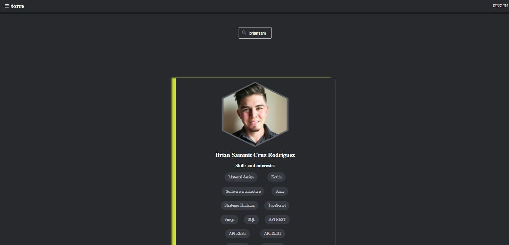

# Skills App

This is a samll app wher you can search for a specific user from the app Terro to see their skills

## Screenshot

## Live demo

[live demo](https://skate-store-react.herokuapp.com)

## Built With

- JavaScript
- HTML
- CSS
- React
- Package.json

## How to start the project from your Local environment

- Open your terminal and cd where you want to store the project
- Run the following command - `git clone https://github.com/BrianSammit/Skills.git`
- Cd into the directory - `cd skills`
- Run `npm install`or `npm i` to install all dependencies.
- Run `npm start`.
- Open your browser and copy paste http://localhost:3000.

## Author

👤 **Brian Cruz**

- Github: [@githubhandle](https://github.com/BrianSammit)
- Twitter: [@twitterhandle](https://twitter.com/cruzsammit)
- Linkedin: [linkedin](https://www.linkedin.com/in/brian-sammit-cruz-rodriguez-5877551a8/)

## Contributing

Contributions, issues, and feature requests are welcome!

Feel free to check the [issues page](https://github.com/BrianSammit/React_bookstore/issues).

## Show your support

Give a ⭐️ if you like this project!

## Acknowledgments

- The Odin Project
- Microverse

## License

This project is MIT licensed.!
